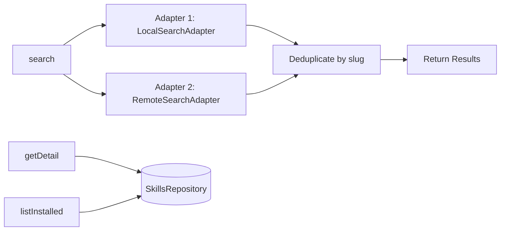

# Catalog Service

Search and browse skills using pluggable search adapters. Multiple adapters run sequentially with results deduplicated by slug (first adapter wins).

## Data Flow



## Public API

### `CatalogService`

| Method | Signature | Description |
|--------|-----------|-------------|
| `search` | `(query: string) => Promise<SkillSearchResult[]>` | Search all adapters, deduplicate by slug |
| `getDetail` | `(skillId: string) => { skill, versions, installations } \| null` | Get full skill details |
| `listInstalled` | `() => Array<Skill & { version }>` | List installed skills (scope-aware via repository) |

### `SearchAdapter` Interface

```typescript
interface SearchAdapter {
  readonly id: string;
  readonly displayName: string;
  search(query: string): Promise<SkillSearchResult[]>;
}
```

## Built-in Adapters

### `LocalSearchAdapter`

Searches the local SQLite database via `SkillsRepository.search()`. Returns results with `source: 'local'` and includes the latest version when available.

### `RemoteSearchAdapter`

Searches the remote marketplace via `RemoteSkillClient.search()`. Returns results with `source: 'remote'`. Silently returns empty on network errors.
