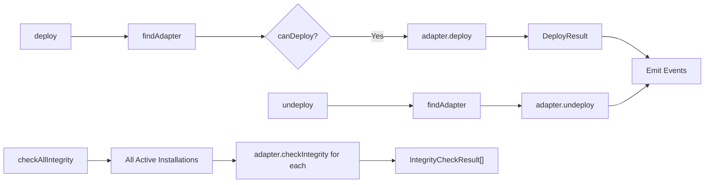

# Deploy Service

Pluggable deploy adapters for writing skill files to disk and managing wrapper scripts.

## Architecture

```
deploy/
  types.ts                  # DeployAdapter interface, DeployContext, DeployResult, IntegrityCheckResult
  deploy.service.ts         # Orchestrates adapters, emits events
  index.ts
```

Adapters are provided by consumers (e.g., `DaemonDeployAdapter` in `libs/shield-daemon`).

## Usage

```typescript
import { DeployService } from '@agentshield/skills';
import type { DeployAdapter } from '@agentshield/skills';

// Consumers provide their own adapter implementation
const adapter: DeployAdapter = createMyAdapter();

const deployer = new DeployService(skillsRepo, [adapter], emitter);
```

## Public API

### `DeployService`

| Method | Signature | Description |
|--------|-----------|-------------|
| `findAdapter` | `(targetId: string \| undefined) => DeployAdapter \| null` | Find first adapter that can deploy to the given target |
| `deploy` | `(installation, version, skill) => Promise<DeployResult \| null>` | Deploy via matching adapter; returns null if no adapter matches |
| `undeploy` | `(installation, version, skill) => Promise<void>` | Remove deployed files via matching adapter |
| `checkAllIntegrity` | `() => Promise<Array<{ installationId, adapterId, result }>>` | Verify file integrity for all active installations |

### `DeployAdapter` Interface

```typescript
interface DeployAdapter {
  readonly id: string;
  readonly displayName: string;
  canDeploy(targetId: string | undefined): boolean;
  deploy(context: DeployContext): Promise<DeployResult>;
  undeploy(installation: SkillInstallation, version: SkillVersion, skill: Skill): Promise<void>;
  checkIntegrity(installation: SkillInstallation, version: SkillVersion, files: SkillFile[]): Promise<IntegrityCheckResult>;
}
```

`canDeploy()` routes installations to the right adapter based on `targetId`.

## Data Flow



### Types

```typescript
interface DeployContext {
  skill: Skill;
  version: SkillVersion;
  files: SkillFile[];
  installation: SkillInstallation;
}

interface DeployResult {
  wrapperPath?: string;
  deployedPath: string;
  deployedHash: string;
}

interface IntegrityCheckResult {
  intact: boolean;
  modifiedFiles: string[];
  missingFiles: string[];
  unexpectedFiles: string[];
  currentHash?: string;
  expectedHash?: string;
}
```

## Contributing

When modifying this module:
- Update this README if public API changes
- Add tests in `__tests__/deploy.service.spec.ts`
- Emit events for new async operations
- Use typed errors from `../errors.ts`
