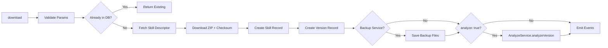

# Download Service

Downloads skills from the remote marketplace, creates local database records, and optionally triggers analysis. Separates the download phase from installation to support review-before-install workflows.

## Data Flow



## Public API

### `DownloadService`

| Method | Signature | Description |
|--------|-----------|-------------|
| `download` | `(params: DownloadParams) => Promise<DownloadResult>` | Download skill from marketplace |

### Types

```typescript
interface DownloadParams {
  slug?: string;       // Marketplace slug (lookup)
  remoteId?: string;   // Direct marketplace ID
  version?: string;    // Specific version (defaults to latest)
  analyze?: boolean;   // Auto-analyze after download
}

interface DownloadResult {
  skill: Skill;
  version: SkillVersion;
}
```

## Events

| Event | Description |
|-------|-------------|
| `download:started` | Download initiated |
| `download:progress` | Download in progress with step info |
| `download:extracting` | Registering in database |
| `download:completed` | Download and registration done |
| `download:error` | Download failed |

## Error Handling

- `SkillsError('...', 'DOWNLOAD_INVALID_PARAMS')` — Missing both `slug` and `remoteId`
- `SkillsError('...', 'DOWNLOAD_OFFLINE')` — No remote client available (offline mode)
- `RemoteSkillNotFoundError` — Skill not found on marketplace

## Contributing

When modifying this module:
- Update this README if public API changes
- Add tests in `__tests__/download.service.spec.ts`
- Emit events for new async operations
- Use typed errors from `../errors.ts`
