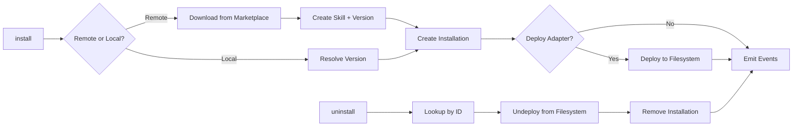

# Install Service

Install and uninstall skills, manage auto-update settings and version pinning. Integrates with `DeployService` to write skill files to disk and create wrapper scripts.

## Data Flow



## Public API

| Method | Signature | Description |
|--------|-----------|-------------|
| `install` | `(params: InstallParams) => Promise<SkillInstallation>` | Install from remote or local skill, deploy if adapter available |
| `uninstall` | `(installationId: string) => Promise<boolean>` | Undeploy + remove installation |
| `setAutoUpdate` | `(installationId: string, enabled: boolean) => void` | Toggle auto-update |
| `pinVersion` | `(installationId: string, version: string) => void` | Pin to a specific version |
| `unpinVersion` | `(installationId: string) => void` | Remove version pin |

## Types

```typescript
interface InstallParams {
  remoteId?: string;    // Remote skill ID (marketplace)
  skillId?: string;     // Local skill ID
  version?: string;     // Specific version (defaults to latest)
  targetId?: string;    // Target scope
  userUsername?: string; // User scope
  autoUpdate?: boolean; // Default: true
}
```

## Deploy Integration

When a `DeployService` is provided to the constructor, `install()` checks if an adapter matches the target via `deployer.findAdapter(targetId)`. If matched:

1. Installation is created with `status: 'pending'`
2. `deployer.deploy()` writes files and creates wrappers
3. Status updates to `'active'` on success, `'disabled'` on failure

Without a deployer, installations are created directly as `'active'`.

`uninstall()` uses `getInstallationById()` for a direct PK lookup (no full-table scan), then calls `deployer.undeploy()` before deleting the DB record.
