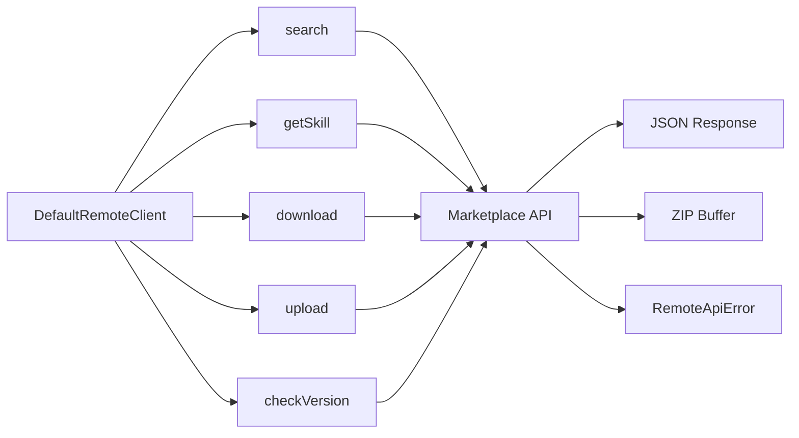

# Remote Client

HTTP client for the AgenShield skill marketplace API. Provides the `RemoteSkillClient` interface and its default implementation.

## Data Flow



## Public API

### `RemoteSkillClient` Interface

```typescript
interface RemoteSkillClient {
  search(query: string, opts?: { page?: number; pageSize?: number }): Promise<RemoteSearchResponse>;
  getSkill(remoteId: string): Promise<RemoteSkillDescriptor | null>;
  download(remoteId: string, version?: string): Promise<{ zipBuffer: Buffer; checksum: string; version: string }>;
  upload(zipBuffer: Buffer, metadata: UploadMetadata): Promise<RemoteSkillDescriptor>;
  checkVersion(remoteId: string, currentVersion: string): Promise<VersionCheckResult | null>;
}
```

### `DefaultRemoteClient`

Default implementation using the Fetch API with AbortController-based timeouts.

| Method | Signature | Description |
|--------|-----------|-------------|
| `search` | `(query, opts?) => Promise<RemoteSearchResponse>` | Search marketplace with pagination |
| `getSkill` | `(remoteId) => Promise<RemoteSkillDescriptor \| null>` | Get skill metadata (returns null on 404) |
| `download` | `(remoteId, version?) => Promise<{ zipBuffer, checksum, version }>` | Download skill ZIP (3x timeout) |
| `upload` | `(zipBuffer, metadata) => Promise<RemoteSkillDescriptor>` | Upload skill ZIP (3x timeout) |
| `checkVersion` | `(remoteId, currentVersion) => Promise<VersionCheckResult \| null>` | Check for updates (null = no update) |

### Configuration

```typescript
interface DefaultRemoteClientOptions {
  baseUrl?: string;   // Default: 'https://skills.agentfront.dev'
  apiKey?: string;    // Optional Bearer token
  timeout?: number;   // Default: 30_000ms
}
```

## Error Handling

- Throws `RemoteApiError` with `.statusCode` and `.responseBody` for non-OK responses
- Returns `null` instead of throwing on 404 for `getSkill()` and `checkVersion()`
- Download and upload use 3x the configured timeout

## Contributing

When modifying this module:
- Update this README if public API changes
- Add tests in `__tests__/remote.client.spec.ts`
- Emit events for new async operations
- Use typed errors from `../errors.ts`
