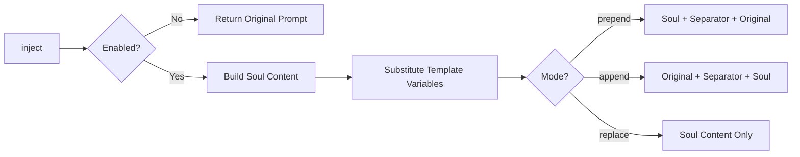

# Soul Injector

Injects security-scoped "soul" content into agent prompts. Supports multiple injection modes and configurable security levels with template variable substitution.

## Data Flow



## Public API

### `SoulInjector`

| Method | Signature | Description |
|--------|-----------|-------------|
| `inject` | `(originalPrompt, context?) => string` | Inject soul content into a prompt |
| `getContent` | `() => string` | Get current soul content |
| `setContent` | `(content: string) => void` | Set custom soul content |
| `getDefaultContent` | `() => string` | Get default medium-security content |
| `enable` | `() => void` | Enable soul injection |
| `disable` | `() => void` | Disable soul injection |
| `isEnabled` | `() => boolean` | Check if enabled |
| `setMode` | `(mode: 'prepend' \| 'append' \| 'replace') => void` | Change injection mode |
| `setSecurityLevel` | `(level: 'low' \| 'medium' \| 'high') => void` | Change security level (resets content if not custom) |

### Types

```typescript
interface SoulConfig {
  enabled: boolean;
  mode: 'prepend' | 'append' | 'replace';
  content?: string;
  securityLevel?: 'low' | 'medium' | 'high';
}

interface InjectionContext {
  securityLevel?: 'low' | 'medium' | 'high';
  allowedOperations?: string[];
  workspacePath?: string;
  variables?: Record<string, string>;
}
```

## Injection Modes

| Mode | Behavior |
|------|----------|
| `prepend` | Soul content inserted before the original prompt |
| `append` | Soul content inserted after the original prompt |
| `replace` | Original prompt replaced entirely with soul content |

## Security Levels

| Level | Description |
|-------|-------------|
| `low` | Basic monitoring and logging, flexible command execution |
| `medium` | Standard security guidelines (broker routing, workspace isolation, policy approval, vault secrets) |
| `high` | Strict enforcement with absolute restrictions, compliance monitoring, audit logging |

## Template Variables

Soul content supports `{{VARIABLE}}` substitution:

| Variable | Source |
|----------|--------|
| `{{WORKSPACE}}` | `context.workspacePath` |
| `{{ALLOWED_OPERATIONS}}` | `context.allowedOperations` (joined) |
| `{{CUSTOM_KEY}}` | `context.variables['CUSTOM_KEY']` |

## Contributing

When modifying this module:
- Update this README if public API changes
- Add tests in `__tests__/soul.spec.ts`
- Emit events for new async operations
- Use typed errors from `../errors.ts`
