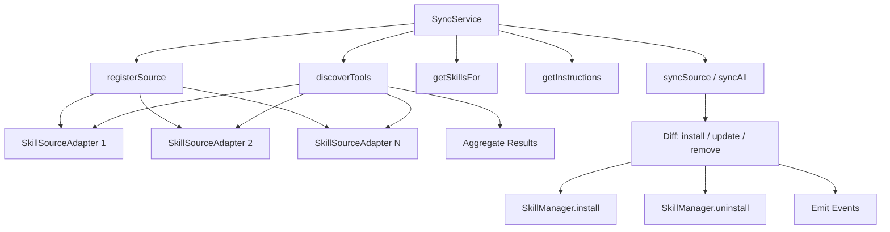

# Sync Service

Multi-source skill synchronization. Aggregates skill discovery, instructions, and binary requirements across pluggable `SkillSourceAdapter` instances, and synchronizes skills to target platforms.

## Data Flow

## Public API

### `SyncService`

| Method | Signature | Description |
|--------|-----------|-------------|
| `registerSource` | `(source: SkillSourceAdapter) => Promise<void>` | Register a skill source adapter |
| `unregisterSource` | `(id: string) => Promise<void>` | Unregister a source by ID |
| `getSource` | `(id: string) => SkillSourceAdapter \| undefined` | Get a source by ID |
| `listSources` | `() => SkillSourceAdapter[]` | List all registered sources |
| `discoverTools` | `(query?: ToolQuery) => Promise<DiscoveredTool[]>` | Aggregate tool discovery across all sources |
| `getSkillsFor` | `(target: TargetPlatform) => Promise<SkillDefinition[]>` | Get skills for a target platform |
| `getAllBins` | `() => Promise<RequiredBinary[]>` | Get all required binaries across sources |
| `getSkillFiles` | `(skillId: string) => Promise<SkillDefinition \| null>` | Get a skill definition by ID |
| `getInstructions` | `() => Promise<AdapterInstructions[]>` | Get adapter instructions (sorted by priority) |
| `syncSource` | `(sourceId: string, target: TargetPlatform) => Promise<AdapterSyncResult>` | Sync a single source (installs/updates/removes) |
| `syncAll` | `(target: TargetPlatform) => Promise<AdapterSyncResult>` | Sync all registered sources |

### `StaticSkillSource`

Built-in adapter for loading skills from the local filesystem or inline definitions.

| Method | Signature | Description |
|--------|-----------|-------------|
| `addFromDirectory` | `(skillId, dirPath, platform?) => void` | Add skill from a directory |
| `addFromFile` | `(skillId, filePath, platform?) => void` | Add skill from a single file |
| `addInline` | `(definition: SkillDefinition) => void` | Add skill from an inline definition |
| `remove` | `(skillId: string) => void` | Remove a skill |
| `loadDirectory` | `(baseDir, platform?) => void` | Bulk load all subdirectories as skills |

## Types

Key types are re-exported from `@agenshield/ipc`:

- `SkillSourceAdapter` — Interface for source adapters
- `TargetPlatform` — Platform target (e.g., `'openclaw'`)
- `SkillDefinition` — Complete skill definition with metadata and files
- `DiscoveredTool` — Tool metadata for discovery
- `ToolQuery` — Query parameters for tool discovery
- `RequiredBinary` — Binary requirement specification
- `AdapterInstructions` — Adapter-specific instructions with priority
- `AdapterSyncResult` — `{ installed, removed, updated, errors }`

## Utilities

- `computeSkillDefinitionSha(files)` — Deterministic SHA-256 hash of skill files (sorted by name)

## Contributing

When modifying this module:
- Update this README if public API changes
- Add tests in `__tests__/sync.service.spec.ts`
- Emit events for new async operations
- Use typed errors from `../errors.ts`
