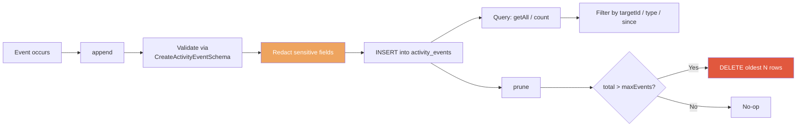
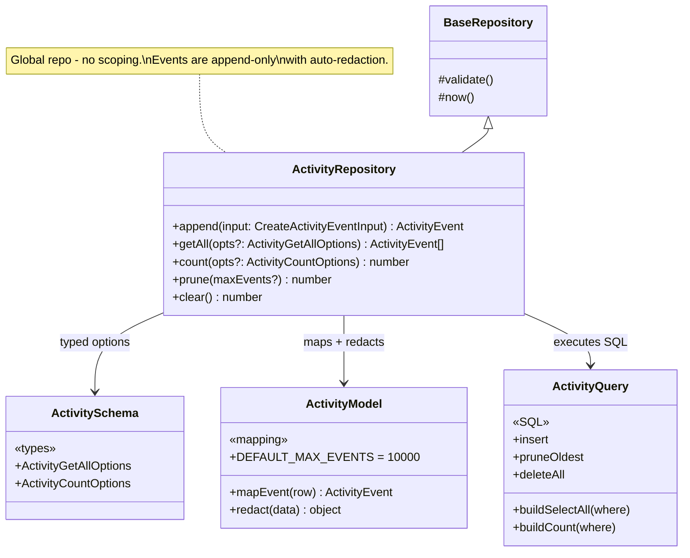
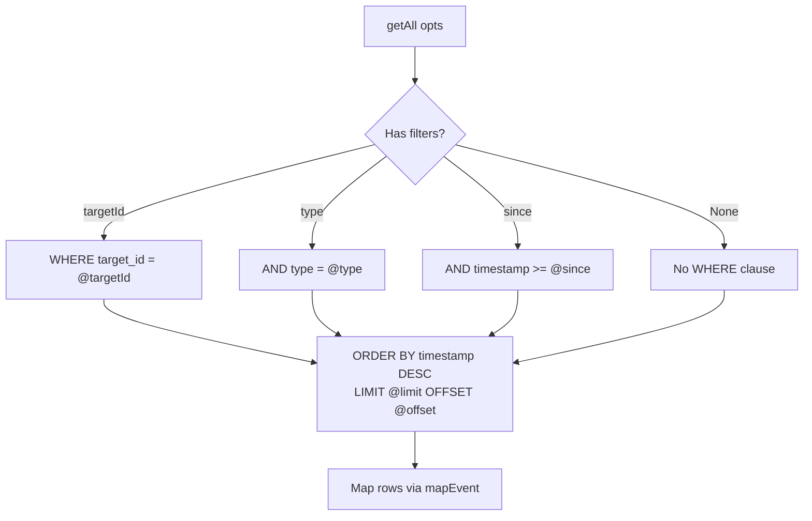

# Activity Repository

Append-only event log with filtering, pruning, and sensitive data redaction.

## Event Lifecycle

```mermaid
graph LR
    A[Event occurs] --> B[append]
    B --> C[Validate via<br>CreateActivityEventSchema]
    C --> D[Redact sensitive fields]
    D --> E[INSERT into activity_events]

    E --> F[Query: getAll / count]
    F --> G[Filter by targetId / type / since]

    E --> H[prune]
    H --> I{total > maxEvents?}
    I -- Yes --> J[DELETE oldest N rows]
    I -- No --> K[No-op]

    style D fill:#EEA45F,color:#fff
    style J fill:#E1583E,color:#fff
```

## File Structure

```mermaid
classDiagram
    class ActivityRepository {
        +append(input: CreateActivityEventInput) ActivityEvent
        +getAll(opts?: ActivityGetAllOptions) ActivityEvent[]
        +count(opts?: ActivityCountOptions) number
        +prune(maxEvents?) number
        +clear() number
    }

    class ActivitySchema {
        «types»
        +ActivityGetAllOptions
        +ActivityCountOptions
    }

    class ActivityModel {
        «mapping»
        +mapEvent(row) ActivityEvent
        +redact(data) object
        +DEFAULT_MAX_EVENTS = 10000
    }

    class ActivityQuery {
        «SQL»
        +insert
        +buildSelectAll(where)
        +buildCount(where)
        +pruneOldest
        +deleteAll
    }

    class BaseRepository {
        #validate()
        #now()
    }

    BaseRepository <|-- ActivityRepository
    ActivityRepository --> ActivitySchema : typed options
    ActivityRepository --> ActivityModel : maps + redacts
    ActivityRepository --> ActivityQuery : executes SQL

    note for ActivityRepository "Global repo - no scoping.\nEvents are append-only\nwith auto-redaction."
```

## Query Building

```mermaid
graph TD
    A[getAll opts] --> B{Has filters?}
    B -- targetId --> C["WHERE target_id = @targetId"]
    B -- type --> D["AND type = @type"]
    B -- since --> E["AND timestamp >= @since"]
    B -- None --> F["No WHERE clause"]

    C --> G[ORDER BY timestamp DESC<br>LIMIT @limit OFFSET @offset]
    D --> G
    E --> G
    F --> G

    G --> H[Map rows via mapEvent]
```
