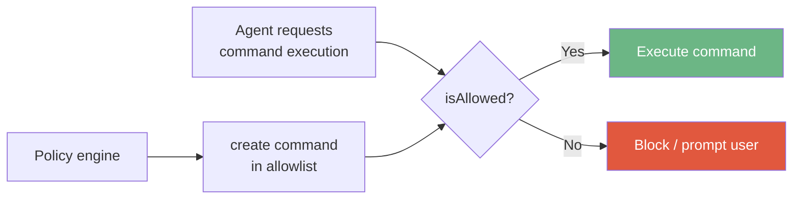
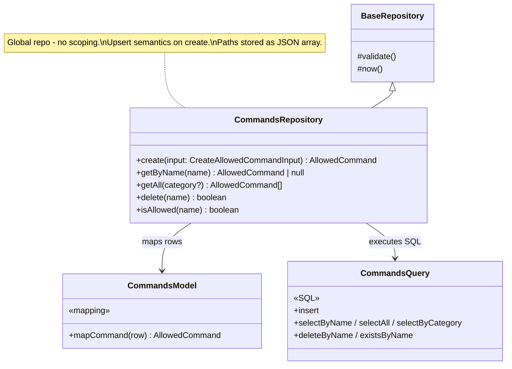
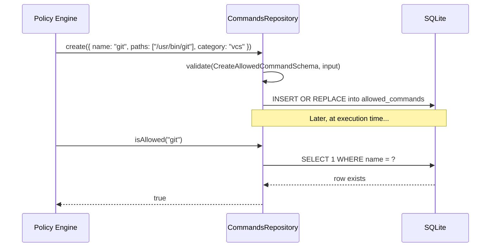

# Commands Repository

Global allowlist of commands with category-based filtering.

## Purpose

```mermaid
graph LR
    A[Agent requests<br>command execution] --> B{isAllowed?}
    B -- Yes --> C[Execute command]
    B -- No --> D[Block / prompt user]

    E[Policy engine] --> F[create command<br>in allowlist]
    F --> B

    style C fill:#6CB685,color:#fff
    style D fill:#E1583E,color:#fff
```

## File Structure

```mermaid
classDiagram
    class CommandsRepository {
        +create(input: CreateAllowedCommandInput) AllowedCommand
        +getByName(name) AllowedCommand | null
        +getAll(category?) AllowedCommand[]
        +delete(name) boolean
        +isAllowed(name) boolean
    }

    class CommandsModel {
        «mapping»
        +mapCommand(row) AllowedCommand
    }

    class CommandsQuery {
        «SQL»
        +insert
        +selectByName / selectAll / selectByCategory
        +deleteByName / existsByName
    }

    class BaseRepository {
        #validate()
        #now()
    }

    BaseRepository <|-- CommandsRepository
    CommandsRepository --> CommandsModel : maps rows
    CommandsRepository --> CommandsQuery : executes SQL

    note for CommandsRepository "Global repo - no scoping.\nUpsert semantics on create.\nPaths stored as JSON array."
```

## Data Flow

```mermaid
sequenceDiagram
    participant Policy as Policy Engine
    participant Repo as CommandsRepository
    participant DB as SQLite

    Policy->>Repo: create({ name: "git", paths: ["/usr/bin/git"], category: "vcs" })
    Repo->>Repo: validate(CreateAllowedCommandSchema, input)
    Repo->>DB: INSERT OR REPLACE into allowed_commands

    Note over Repo,DB: Later, at execution time...

    Policy->>Repo: isAllowed("git")
    Repo->>DB: SELECT 1 WHERE name = ?
    DB-->>Repo: row exists
    Repo-->>Policy: true
```
