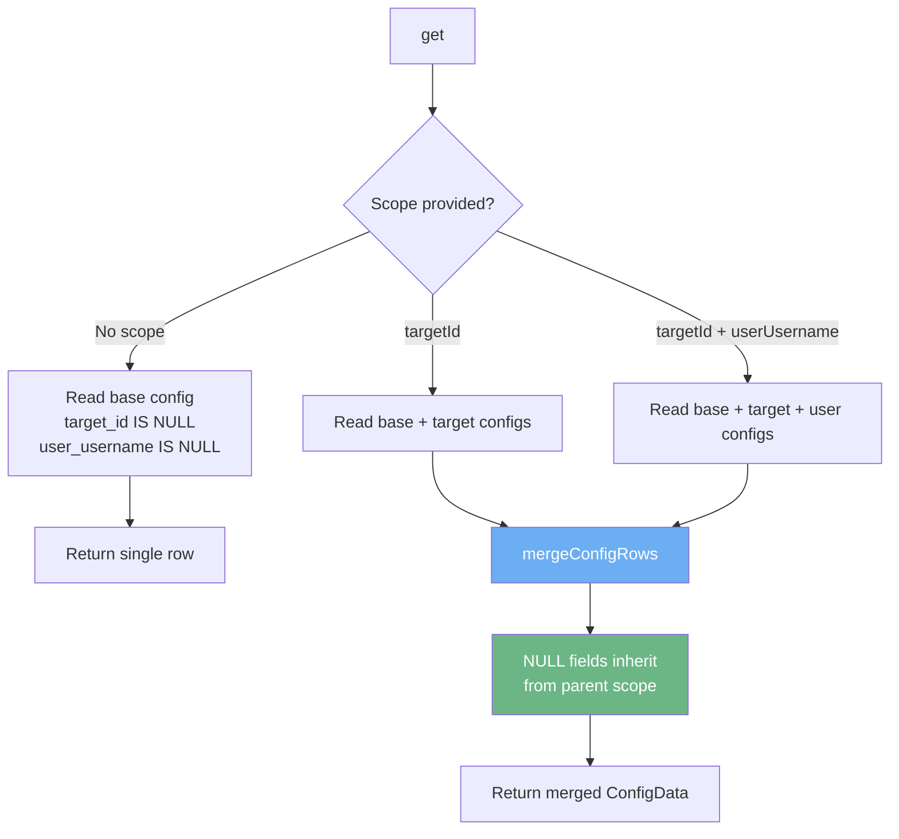
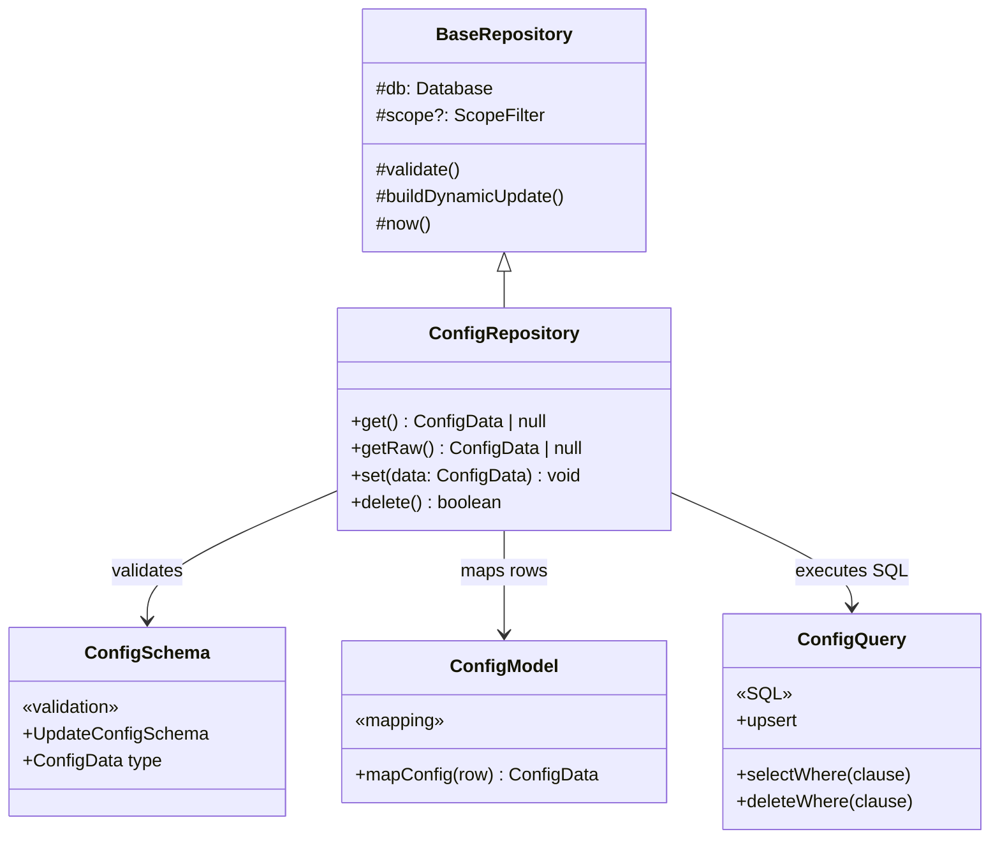
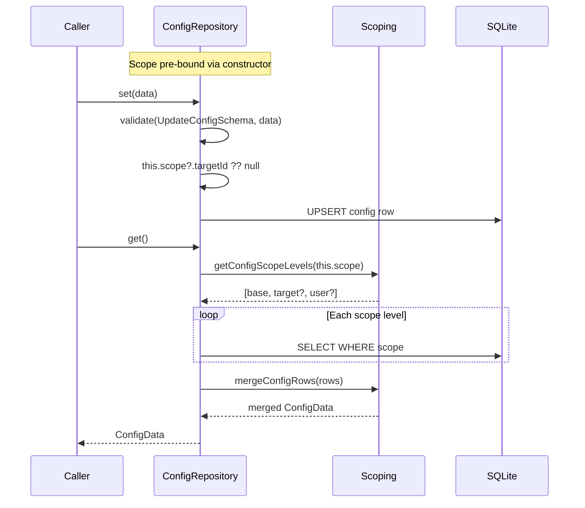

# Config Repository

Scoped configuration with cascading merge. NULL values inherit from parent scope.

## Scope Resolution

```mermaid
graph TD
    A[get] --> B{Scope provided?}
    B -- "No scope" --> C[Read base config<br>target_id IS NULL<br>user_username IS NULL]
    B -- "targetId" --> D[Read base + target configs]
    B -- "targetId + userUsername" --> E[Read base + target + user configs]

    C --> F[Return single row]
    D --> G[mergeConfigRows]
    E --> G

    G --> H[NULL fields inherit<br>from parent scope]
    H --> I[Return merged ConfigData]

    style G fill:#6BAEF2,color:#fff
    style H fill:#6CB685,color:#fff
```

## File Structure

```mermaid
classDiagram
    class ConfigRepository {
        +get() ConfigData | null
        +getRaw() ConfigData | null
        +set(data: ConfigData) void
        +delete() boolean
    }

    class ConfigSchema {
        «validation»
        +UpdateConfigSchema
        +ConfigData type
    }

    class ConfigModel {
        «mapping»
        +mapConfig(row) ConfigData
    }

    class ConfigQuery {
        «SQL»
        +selectWhere(clause)
        +upsert
        +deleteWhere(clause)
    }

    class BaseRepository {
        #db: Database
        #scope?: ScopeFilter
        #validate()
        #buildDynamicUpdate()
        #now()
    }

    BaseRepository <|-- ConfigRepository
    ConfigRepository --> ConfigSchema : validates
    ConfigRepository --> ConfigModel : maps rows
    ConfigRepository --> ConfigQuery : executes SQL
```

## Data Flow

```mermaid
sequenceDiagram
    participant Caller
    participant Repo as ConfigRepository
    participant Scoping
    participant DB as SQLite

    Note over Repo: Scope pre-bound via constructor

    Caller->>Repo: set(data)
    Repo->>Repo: validate(UpdateConfigSchema, data)
    Repo->>Repo: this.scope?.targetId ?? null
    Repo->>DB: UPSERT config row

    Caller->>Repo: get()
    Repo->>Scoping: getConfigScopeLevels(this.scope)
    Scoping-->>Repo: [base, target?, user?]
    loop Each scope level
        Repo->>DB: SELECT WHERE scope
    end
    Repo->>Scoping: mergeConfigRows(rows)
    Scoping-->>Repo: merged ConfigData
    Repo-->>Caller: ConfigData
```
