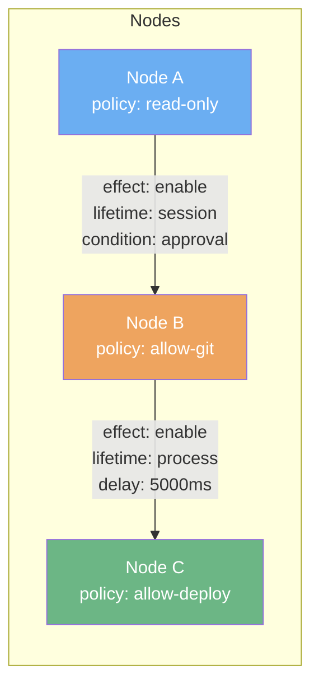
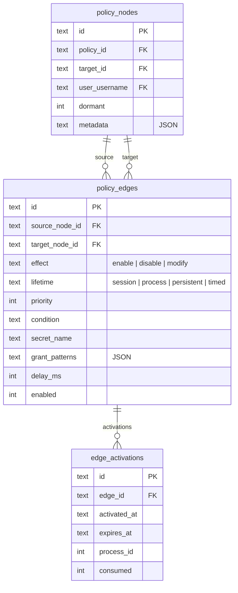
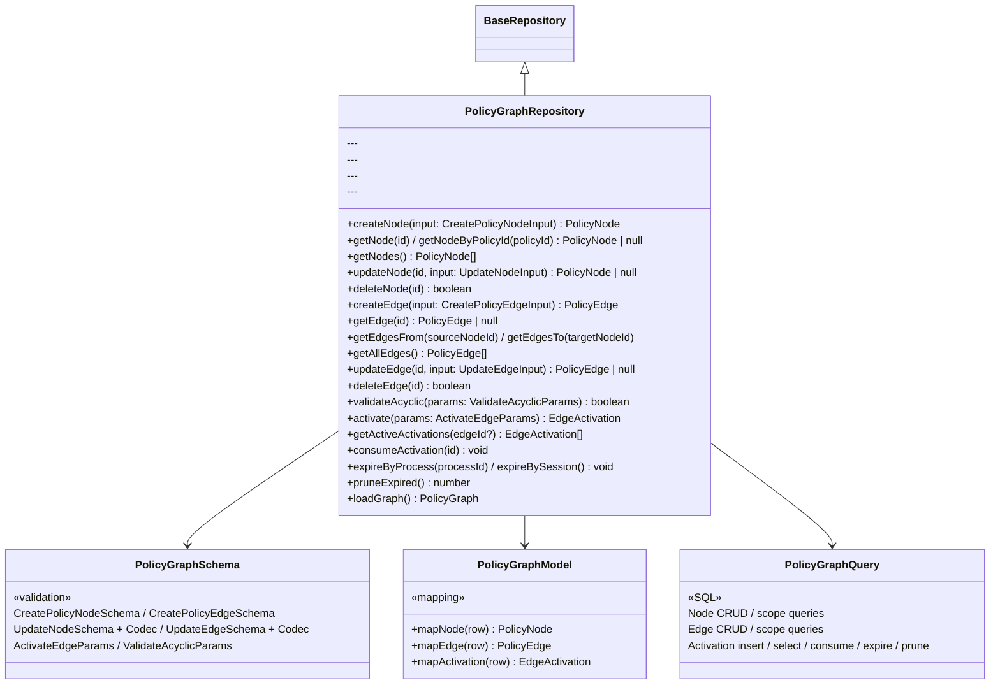
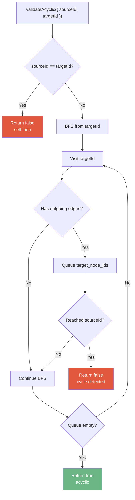
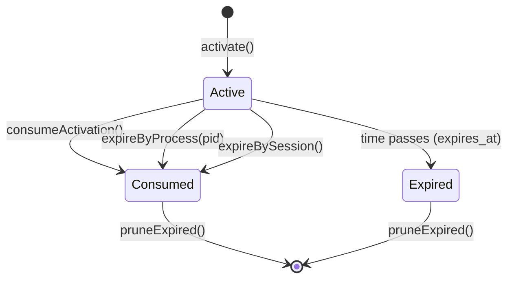

# Policy Graph Repository

Conditional policy chaining via a directed acyclic graph (DAG).

## Graph Model

```mermaid
graph LR
    subgraph Nodes
        N1[Node A<br>policy: read-only]
        N2[Node B<br>policy: allow-git]
        N3[Node C<br>policy: allow-deploy]
    end

    N1 -- "effect: enable<br>lifetime: session<br>condition: approval" --> N2
    N2 -- "effect: enable<br>lifetime: process<br>delay: 5000ms" --> N3

    style N1 fill:#6BAEF2,color:#fff
    style N2 fill:#EEA45F,color:#fff
    style N3 fill:#6CB685,color:#fff
```

## Data Model

```mermaid
erDiagram
    policy_nodes {
        text id PK
        text policy_id FK
        text target_id FK
        text user_username FK
        int dormant
        text metadata "JSON"
    }

    policy_edges {
        text id PK
        text source_node_id FK
        text target_node_id FK
        text effect "enable | disable | modify"
        text lifetime "session | process | persistent | timed"
        int priority
        text condition
        text secret_name
        text grant_patterns "JSON"
        int delay_ms
        int enabled
    }

    edge_activations {
        text id PK
        text edge_id FK
        text activated_at
        text expires_at
        int process_id
        int consumed
    }

    policy_nodes ||--o{ policy_edges : "source"
    policy_nodes ||--o{ policy_edges : "target"
    policy_edges ||--o{ edge_activations : "activations"
```

## File Structure

```mermaid
classDiagram
    class PolicyGraphRepository {
        +createNode(input: CreatePolicyNodeInput) PolicyNode
        +getNode(id) / getNodeByPolicyId(policyId) PolicyNode | null
        +getNodes() PolicyNode[]
        +updateNode(id, input: UpdateNodeInput) PolicyNode | null
        +deleteNode(id) boolean
        ---
        +createEdge(input: CreatePolicyEdgeInput) PolicyEdge
        +getEdge(id) PolicyEdge | null
        +getEdgesFrom(sourceNodeId) / getEdgesTo(targetNodeId)
        +getAllEdges() PolicyEdge[]
        +updateEdge(id, input: UpdateEdgeInput) PolicyEdge | null
        +deleteEdge(id) boolean
        ---
        +validateAcyclic(params: ValidateAcyclicParams) boolean
        ---
        +activate(params: ActivateEdgeParams) EdgeActivation
        +getActiveActivations(edgeId?) EdgeActivation[]
        +consumeActivation(id) void
        +expireByProcess(processId) / expireBySession() void
        +pruneExpired() number
        ---
        +loadGraph() PolicyGraph
    }

    class PolicyGraphSchema {
        «validation»
        CreatePolicyNodeSchema / CreatePolicyEdgeSchema
        UpdateNodeSchema + Codec / UpdateEdgeSchema + Codec
        ActivateEdgeParams / ValidateAcyclicParams
    }

    class PolicyGraphModel {
        «mapping»
        +mapNode(row) PolicyNode
        +mapEdge(row) PolicyEdge
        +mapActivation(row) EdgeActivation
    }

    class PolicyGraphQuery {
        «SQL»
        Node CRUD / scope queries
        Edge CRUD / scope queries
        Activation insert / select / consume / expire / prune
    }

    BaseRepository <|-- PolicyGraphRepository
    PolicyGraphRepository --> PolicyGraphSchema
    PolicyGraphRepository --> PolicyGraphModel
    PolicyGraphRepository --> PolicyGraphQuery
```

## Acyclic Validation

```mermaid
graph TD
    A["validateAcyclic({ sourceId, targetId })"] --> B{sourceId == targetId?}
    B -- Yes --> C[Return false<br>self-loop]
    B -- No --> D[BFS from targetId]

    D --> E[Visit targetId]
    E --> F{Has outgoing edges?}
    F -- Yes --> G[Queue target_node_ids]
    F -- No --> H[Continue BFS]

    G --> I{Reached sourceId?}
    I -- Yes --> J[Return false<br>cycle detected]
    I -- No --> H

    H --> K{Queue empty?}
    K -- Yes --> L[Return true<br>acyclic]
    K -- No --> E

    style C fill:#E1583E,color:#fff
    style J fill:#E1583E,color:#fff
    style L fill:#6CB685,color:#fff
```

## Activation Lifecycle

```mermaid
stateDiagram-v2
    [*] --> Active : activate()
    Active --> Consumed : consumeActivation()
    Active --> Expired : time passes (expires_at)
    Active --> Consumed : expireByProcess(pid)
    Active --> Consumed : expireBySession()
    Consumed --> [*] : pruneExpired()
    Expired --> [*] : pruneExpired()
```
