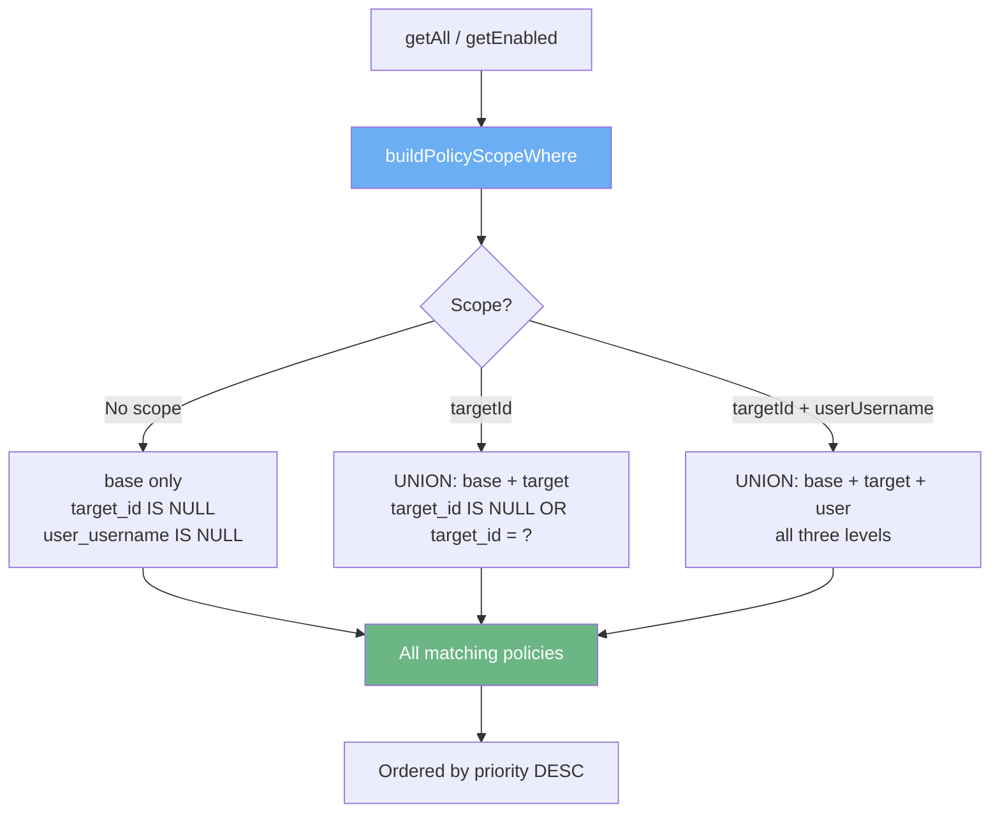
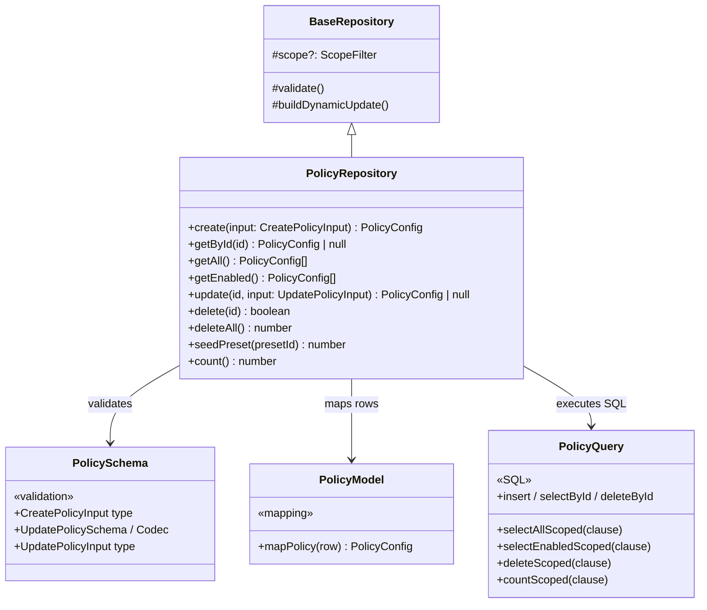
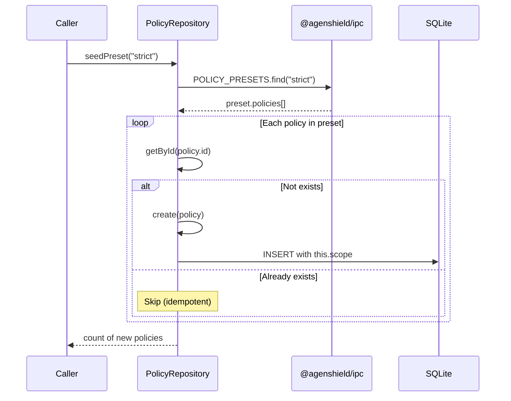

# Policy Repository

Scoped policy CRUD with UNION-based scope resolution and preset seeding.

## Scope Resolution (Policies)

```mermaid
graph TD
    A[getAll / getEnabled] --> B[buildPolicyScopeWhere]
    B --> C{Scope?}

    C -- "No scope" --> D["base only<br>target_id IS NULL<br>user_username IS NULL"]
    C -- "targetId" --> E["UNION: base + target<br>target_id IS NULL OR target_id = ?"]
    C -- "targetId + userUsername" --> F["UNION: base + target + user<br>all three levels"]

    D --> G[All matching policies]
    E --> G
    F --> G

    G --> H[Ordered by priority DESC]

    style B fill:#6BAEF2,color:#fff
    style G fill:#6CB685,color:#fff
```

## File Structure

```mermaid
classDiagram
    class PolicyRepository {
        +create(input: CreatePolicyInput) PolicyConfig
        +getById(id) PolicyConfig | null
        +getAll() PolicyConfig[]
        +getEnabled() PolicyConfig[]
        +update(id, input: UpdatePolicyInput) PolicyConfig | null
        +delete(id) boolean
        +deleteAll() number
        +seedPreset(presetId) number
        +count() number
    }

    class PolicySchema {
        «validation»
        +CreatePolicyInput type
        +UpdatePolicySchema / Codec
        +UpdatePolicyInput type
    }

    class PolicyModel {
        «mapping»
        +mapPolicy(row) PolicyConfig
    }

    class PolicyQuery {
        «SQL»
        +insert / selectById / deleteById
        +selectAllScoped(clause)
        +selectEnabledScoped(clause)
        +deleteScoped(clause)
        +countScoped(clause)
    }

    class BaseRepository {
        #scope?: ScopeFilter
        #validate()
        #buildDynamicUpdate()
    }

    BaseRepository <|-- PolicyRepository
    PolicyRepository --> PolicySchema : validates
    PolicyRepository --> PolicyModel : maps rows
    PolicyRepository --> PolicyQuery : executes SQL
```

## Preset Seeding Flow

```mermaid
sequenceDiagram
    participant Caller
    participant Repo as PolicyRepository
    participant IPC as @agenshield/ipc
    participant DB as SQLite

    Caller->>Repo: seedPreset("strict")
    Repo->>IPC: POLICY_PRESETS.find("strict")
    IPC-->>Repo: preset.policies[]

    loop Each policy in preset
        Repo->>Repo: getById(policy.id)
        alt Not exists
            Repo->>Repo: create(policy)
            Repo->>DB: INSERT with this.scope
        else Already exists
            Note over Repo: Skip (idempotent)
        end
    end

    Repo-->>Caller: count of new policies
```
