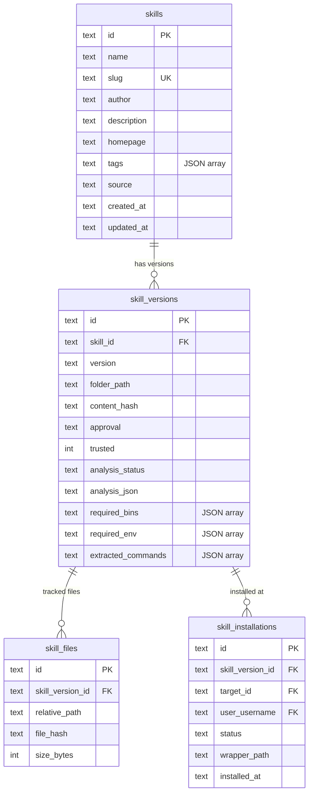
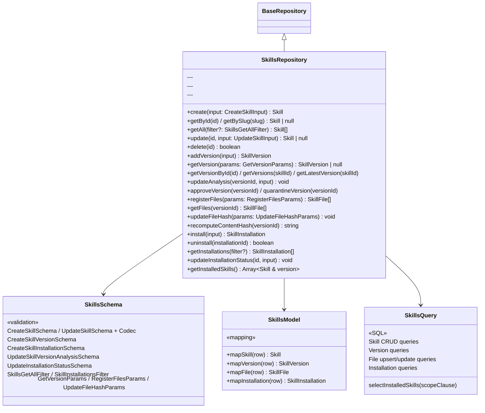
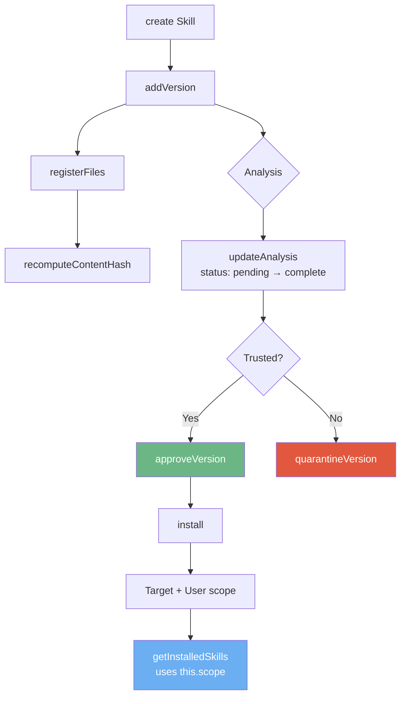
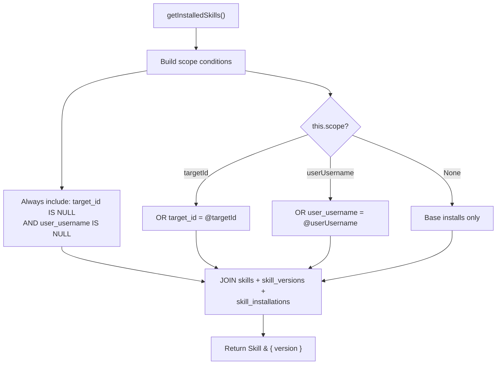

# Skills Repository

Unified skill registry managing skill identities, versions, files, and installations.

## Domain Model

```mermaid
erDiagram
    skills {
        text id PK
        text name
        text slug UK
        text author
        text description
        text homepage
        text tags "JSON array"
        text source
        text created_at
        text updated_at
    }

    skill_versions {
        text id PK
        text skill_id FK
        text version
        text folder_path
        text content_hash
        text approval
        int trusted
        text analysis_status
        text analysis_json
        text required_bins "JSON array"
        text required_env "JSON array"
        text extracted_commands "JSON array"
    }

    skill_files {
        text id PK
        text skill_version_id FK
        text relative_path
        text file_hash
        int size_bytes
    }

    skill_installations {
        text id PK
        text skill_version_id FK
        text target_id FK
        text user_username FK
        text status
        text wrapper_path
        text installed_at
    }

    skills ||--o{ skill_versions : "has versions"
    skill_versions ||--o{ skill_files : "tracked files"
    skill_versions ||--o{ skill_installations : "installed at"
```

## File Structure

```mermaid
classDiagram
    class SkillsRepository {
        +create(input: CreateSkillInput) Skill
        +getById(id) / getBySlug(slug) Skill | null
        +getAll(filter?: SkillsGetAllFilter) Skill[]
        +update(id, input: UpdateSkillInput) Skill | null
        +delete(id) boolean
        ---
        +addVersion(input) SkillVersion
        +getVersion(params: GetVersionParams) SkillVersion | null
        +getVersionById(id) / getVersions(skillId) / getLatestVersion(skillId)
        +updateAnalysis(versionId, input) void
        +approveVersion(versionId) / quarantineVersion(versionId)
        ---
        +registerFiles(params: RegisterFilesParams) SkillFile[]
        +getFiles(versionId) SkillFile[]
        +updateFileHash(params: UpdateFileHashParams) void
        +recomputeContentHash(versionId) string
        ---
        +install(input) SkillInstallation
        +uninstall(installationId) boolean
        +getInstallations(filter?) SkillInstallation[]
        +updateInstallationStatus(id, input) void
        +getInstalledSkills() Array~Skill & version~
    }

    class SkillsSchema {
        «validation»
        CreateSkillSchema / UpdateSkillSchema + Codec
        CreateSkillVersionSchema
        CreateSkillInstallationSchema
        UpdateSkillVersionAnalysisSchema
        UpdateInstallationStatusSchema
        SkillsGetAllFilter / SkillInstallationsFilter
        GetVersionParams / RegisterFilesParams / UpdateFileHashParams
    }

    class SkillsModel {
        «mapping»
        +mapSkill(row) Skill
        +mapVersion(row) SkillVersion
        +mapFile(row) SkillFile
        +mapInstallation(row) SkillInstallation
    }

    class SkillsQuery {
        «SQL»
        Skill CRUD queries
        Version queries
        File upsert/update queries
        Installation queries
        selectInstalledSkills(scopeClause)
    }

    BaseRepository <|-- SkillsRepository
    SkillsRepository --> SkillsSchema
    SkillsRepository --> SkillsModel
    SkillsRepository --> SkillsQuery
```

## Skill Lifecycle

```mermaid
graph TD
    A[create Skill] --> B[addVersion]
    B --> C[registerFiles]
    C --> D[recomputeContentHash]

    B --> E{Analysis}
    E --> F[updateAnalysis<br>status: pending → complete]
    F --> G{Trusted?}
    G -- Yes --> H[approveVersion]
    G -- No --> I[quarantineVersion]

    H --> J[install]
    J --> K[Target + User scope]
    K --> L[getInstalledSkills<br>uses this.scope]

    style H fill:#6CB685,color:#fff
    style I fill:#E1583E,color:#fff
    style L fill:#6BAEF2,color:#fff
```

## Installed Skills (Scoped)

```mermaid
graph TD
    A["getInstalledSkills()"] --> B["Build scope conditions"]
    B --> C["Always include: target_id IS NULL<br>AND user_username IS NULL"]

    B --> D{this.scope?}
    D -- "targetId" --> E["OR target_id = @targetId"]
    D -- "userUsername" --> F["OR user_username = @userUsername"]
    D -- "None" --> G["Base installs only"]

    C --> H["JOIN skills + skill_versions +<br>skill_installations"]
    E --> H
    F --> H
    G --> H

    H --> I["Return Skill & { version }"]
```
