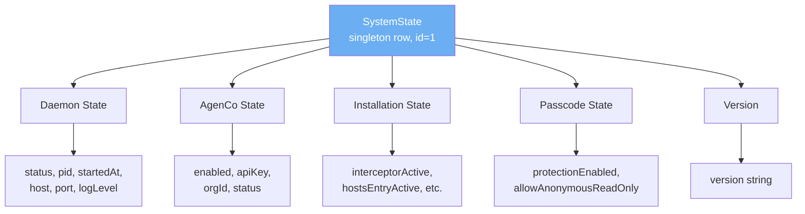
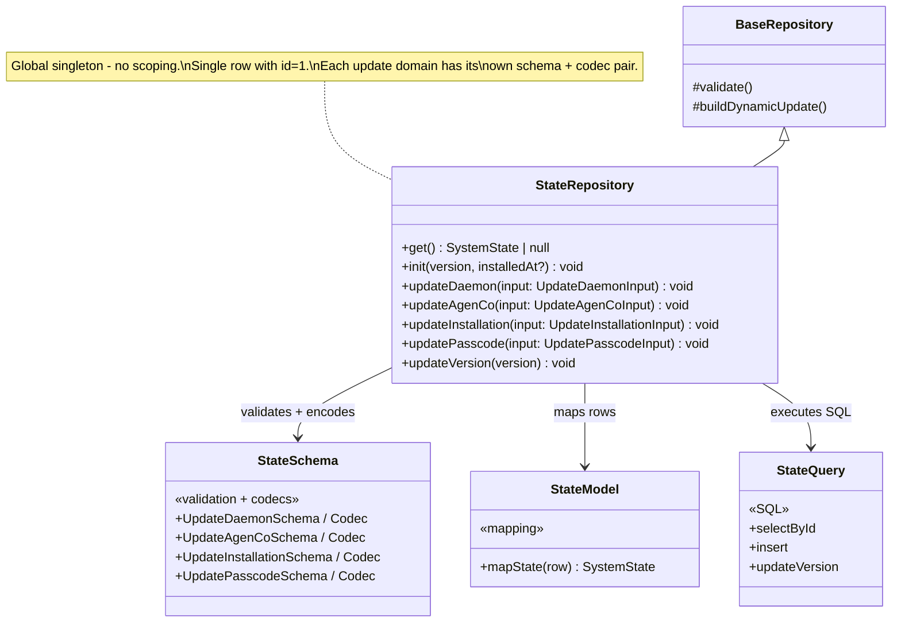
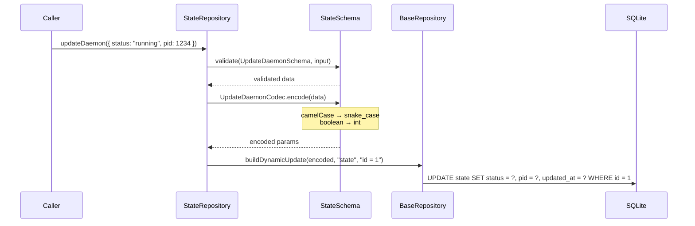

# State Repository

Global singleton holding system-wide runtime state.

## State Structure

```mermaid
graph TD
    A[SystemState<br>singleton row, id=1] --> B[Daemon State]
    A --> C[AgenCo State]
    A --> D[Installation State]
    A --> E[Passcode State]
    A --> F[Version]

    B --> B1[status, pid, startedAt,<br>host, port, logLevel]
    C --> C1[enabled, apiKey,<br>orgId, status]
    D --> D1[interceptorActive,<br>hostsEntryActive, etc.]
    E --> E1[protectionEnabled,<br>allowAnonymousReadOnly]
    F --> F1[version string]

    style A fill:#6BAEF2,color:#fff
```

## File Structure

```mermaid
classDiagram
    class StateRepository {
        +get() SystemState | null
        +init(version, installedAt?) void
        +updateDaemon(input: UpdateDaemonInput) void
        +updateAgenCo(input: UpdateAgenCoInput) void
        +updateInstallation(input: UpdateInstallationInput) void
        +updatePasscode(input: UpdatePasscodeInput) void
        +updateVersion(version) void
    }

    class StateSchema {
        «validation + codecs»
        +UpdateDaemonSchema / Codec
        +UpdateAgenCoSchema / Codec
        +UpdateInstallationSchema / Codec
        +UpdatePasscodeSchema / Codec
    }

    class StateModel {
        «mapping»
        +mapState(row) SystemState
    }

    class StateQuery {
        «SQL»
        +selectById
        +insert
        +updateVersion
    }

    class BaseRepository {
        #validate()
        #buildDynamicUpdate()
    }

    BaseRepository <|-- StateRepository
    StateRepository --> StateSchema : validates + encodes
    StateRepository --> StateModel : maps rows
    StateRepository --> StateQuery : executes SQL

    note for StateRepository "Global singleton - no scoping.\nSingle row with id=1.\nEach update domain has its\nown schema + codec pair."
```

## Update Pattern

```mermaid
sequenceDiagram
    participant Caller
    participant Repo as StateRepository
    participant Schema as StateSchema
    participant Base as BaseRepository
    participant DB as SQLite

    Caller->>Repo: updateDaemon({ status: "running", pid: 1234 })
    Repo->>Schema: validate(UpdateDaemonSchema, input)
    Schema-->>Repo: validated data
    Repo->>Schema: UpdateDaemonCodec.encode(data)
    Note over Schema: camelCase → snake_case<br>boolean → int
    Schema-->>Repo: encoded params
    Repo->>Base: buildDynamicUpdate(encoded, "state", "id = 1")
    Base->>DB: UPDATE state SET status = ?, pid = ?, updated_at = ? WHERE id = 1
```
