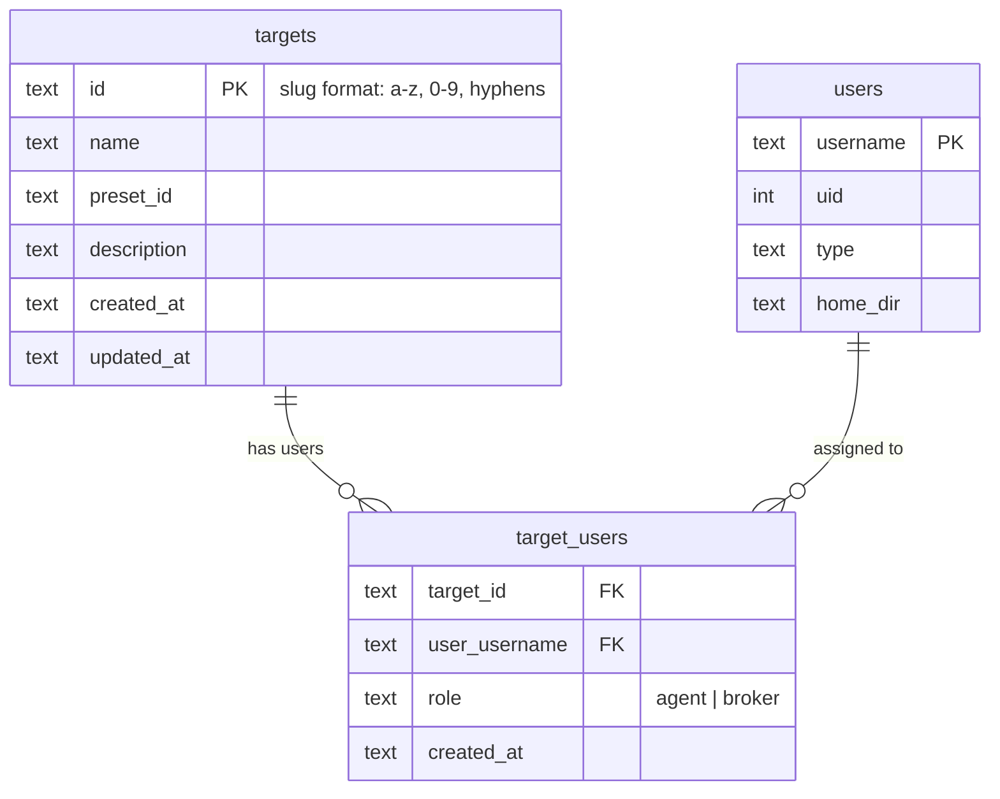
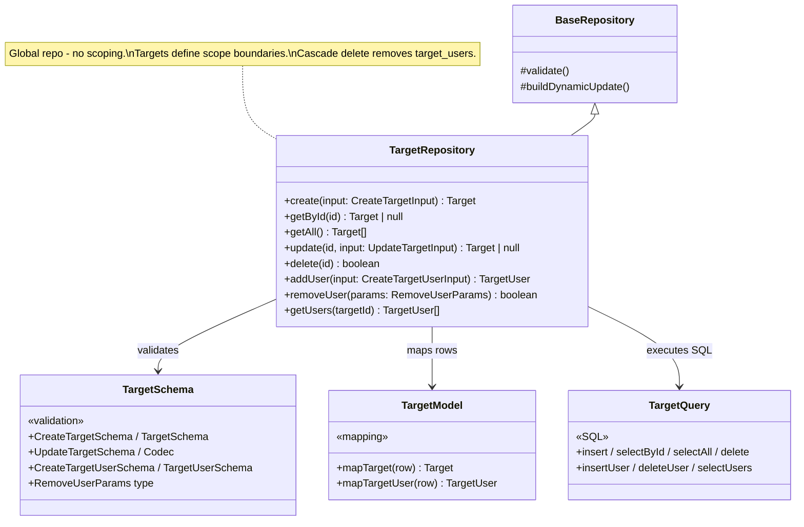
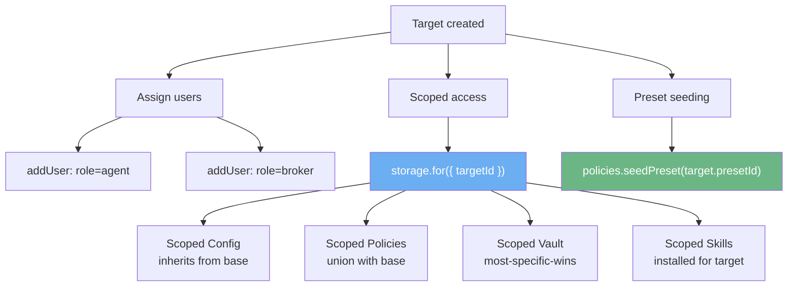

# Target Repository

Manages target environments and their user assignments.

## Domain Model

```mermaid
erDiagram
    targets {
        text id PK "slug format: a-z, 0-9, hyphens"
        text name
        text preset_id
        text description
        text created_at
        text updated_at
    }

    users {
        text username PK
        int uid
        text type
        text home_dir
    }

    target_users {
        text target_id FK
        text user_username FK
        text role "agent | broker"
        text created_at
    }

    targets ||--o{ target_users : "has users"
    users ||--o{ target_users : "assigned to"
```

## File Structure

```mermaid
classDiagram
    class TargetRepository {
        +create(input: CreateTargetInput) Target
        +getById(id) Target | null
        +getAll() Target[]
        +update(id, input: UpdateTargetInput) Target | null
        +delete(id) boolean
        +addUser(input: CreateTargetUserInput) TargetUser
        +removeUser(params: RemoveUserParams) boolean
        +getUsers(targetId) TargetUser[]
    }

    class TargetSchema {
        «validation»
        +CreateTargetSchema / TargetSchema
        +UpdateTargetSchema / Codec
        +CreateTargetUserSchema / TargetUserSchema
        +RemoveUserParams type
    }

    class TargetModel {
        «mapping»
        +mapTarget(row) Target
        +mapTargetUser(row) TargetUser
    }

    class TargetQuery {
        «SQL»
        +insert / selectById / selectAll / delete
        +insertUser / deleteUser / selectUsers
    }

    class BaseRepository {
        #validate()
        #buildDynamicUpdate()
    }

    BaseRepository <|-- TargetRepository
    TargetRepository --> TargetSchema : validates
    TargetRepository --> TargetModel : maps rows
    TargetRepository --> TargetQuery : executes SQL

    note for TargetRepository "Global repo - no scoping.\nTargets define scope boundaries.\nCascade delete removes target_users."
```

## Target as Scope Boundary

```mermaid
graph TD
    A[Target created] --> B[Assign users]
    B --> C[addUser: role=agent]
    B --> D[addUser: role=broker]

    A --> E[Scoped access]
    E --> F["storage.for({ targetId })"]
    F --> G[Scoped Config<br>inherits from base]
    F --> H[Scoped Policies<br>union with base]
    F --> I[Scoped Vault<br>most-specific-wins]
    F --> J[Scoped Skills<br>installed for target]

    A --> K[Preset seeding]
    K --> L["policies.seedPreset(target.presetId)"]

    style F fill:#6BAEF2,color:#fff
    style L fill:#6CB685,color:#fff
```
