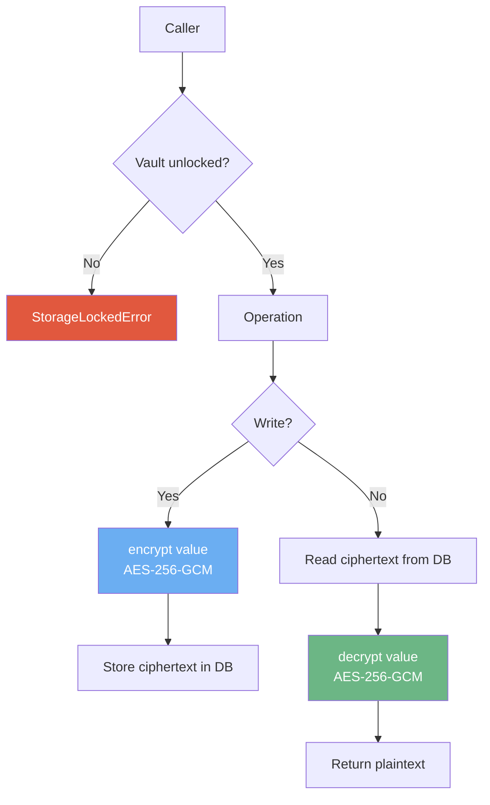
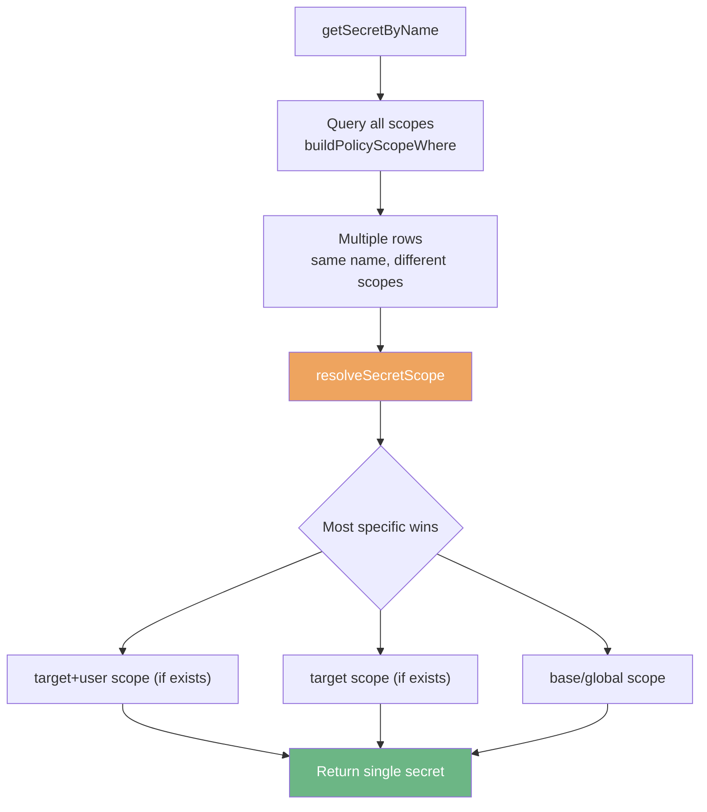
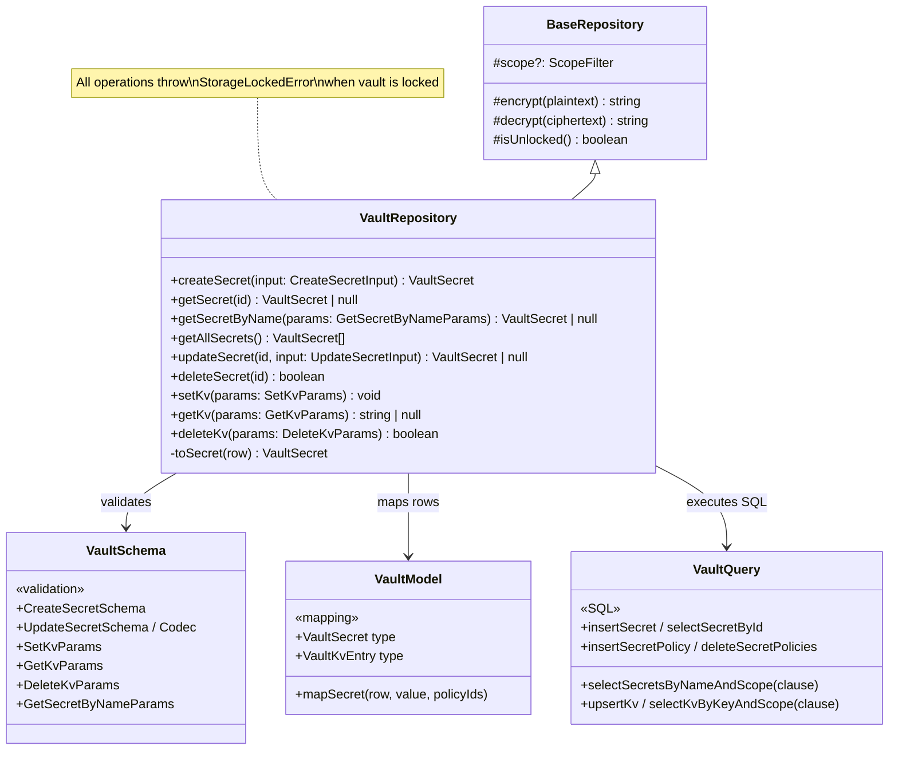
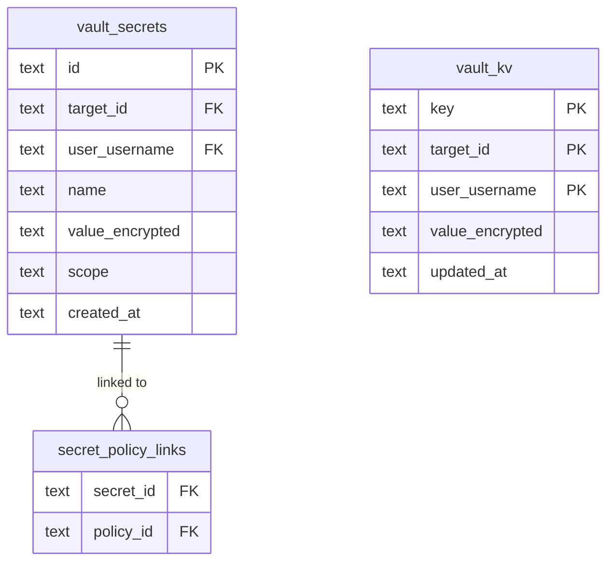

# Vault Repository

Encrypted secrets and key-value store with scope resolution.

## Encryption Flow

```mermaid
graph TD
    A[Caller] --> B{Vault unlocked?}
    B -- No --> C[StorageLockedError]
    B -- Yes --> D[Operation]

    D --> E{Write?}
    E -- Yes --> F[encrypt value<br>AES-256-GCM]
    F --> G[Store ciphertext in DB]

    E -- No --> H[Read ciphertext from DB]
    H --> I[decrypt value<br>AES-256-GCM]
    I --> J[Return plaintext]

    style C fill:#E1583E,color:#fff
    style F fill:#6BAEF2,color:#fff
    style I fill:#6CB685,color:#fff
```

## Scope Resolution (Secrets)

```mermaid
graph TD
    A[getSecretByName] --> B[Query all scopes<br>buildPolicyScopeWhere]
    B --> C[Multiple rows<br>same name, different scopes]
    C --> D[resolveSecretScope]
    D --> E{Most specific wins}

    E --> F["target+user scope (if exists)"]
    E --> G["target scope (if exists)"]
    E --> H["base/global scope"]

    F --> I[Return single secret]
    G --> I
    H --> I

    style D fill:#EEA45F,color:#fff
    style I fill:#6CB685,color:#fff
```

## File Structure

```mermaid
classDiagram
    class VaultRepository {
        +createSecret(input: CreateSecretInput) VaultSecret
        +getSecret(id) VaultSecret | null
        +getSecretByName(params: GetSecretByNameParams) VaultSecret | null
        +getAllSecrets() VaultSecret[]
        +updateSecret(id, input: UpdateSecretInput) VaultSecret | null
        +deleteSecret(id) boolean
        +setKv(params: SetKvParams) void
        +getKv(params: GetKvParams) string | null
        +deleteKv(params: DeleteKvParams) boolean
        -toSecret(row) VaultSecret
    }

    class VaultSchema {
        «validation»
        +CreateSecretSchema
        +UpdateSecretSchema / Codec
        +SetKvParams
        +GetKvParams
        +DeleteKvParams
        +GetSecretByNameParams
    }

    class VaultModel {
        «mapping»
        +mapSecret(row, value, policyIds)
        +VaultSecret type
        +VaultKvEntry type
    }

    class VaultQuery {
        «SQL»
        +insertSecret / selectSecretById
        +selectSecretsByNameAndScope(clause)
        +upsertKv / selectKvByKeyAndScope(clause)
        +insertSecretPolicy / deleteSecretPolicies
    }

    class BaseRepository {
        #encrypt(plaintext) string
        #decrypt(ciphertext) string
        #isUnlocked() boolean
        #scope?: ScopeFilter
    }

    BaseRepository <|-- VaultRepository
    VaultRepository --> VaultSchema : validates
    VaultRepository --> VaultModel : maps rows
    VaultRepository --> VaultQuery : executes SQL

    note for VaultRepository "All operations throw\nStorageLockedError\nwhen vault is locked"
```

## Data Model

```mermaid
erDiagram
    vault_secrets {
        text id PK
        text target_id FK
        text user_username FK
        text name
        text value_encrypted
        text scope
        text created_at
    }

    vault_kv {
        text key PK
        text target_id PK
        text user_username PK
        text value_encrypted
        text updated_at
    }

    secret_policy_links {
        text secret_id FK
        text policy_id FK
    }

    vault_secrets ||--o{ secret_policy_links : "linked to"
```
